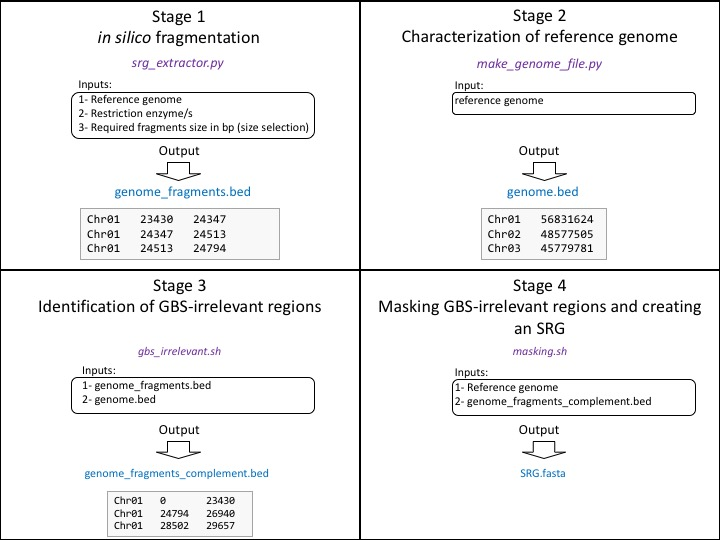

# SRG Extractor

A bioinformatic program designed to create a skinny reference genome (SRG) for reduced-representation sequencing (RRS) analysis.

This work is based on an original idea of Davoud Torkamaneh, postdoc at Guelph University, Canada.


## Introduction

Reduced-representation sequencing (RRS) is a genome-wide scanning method for simultaneous
discovery and genotyping of thousands to millions of SNPs that is used across a wide range
of species. However, in this method a reproducible but very small fraction of the genome is
captured for sequencing, however sequencing reads are typically aligned against the entire 
reference genome. Here we present a skinny reference genome (SRG) approach in which a 
simplified reference genome is used to decrease computing time for data processing and
to increase SNP counts and accuracy. A SRG can be integrated into any RRS analytical pipeline.  

## Requirements

1. Linux with parallel installed (http://www.gnu.org/software/parallel/)  
2. Python 2.7 or higher (https://www.python.org/) 
3. Biopython (https://biopython.org/)
4. bwa (https://github.com/lh3/bwa)  
5. samtools (http://www.htslib.org/)  
6. bedtools (https://bedtools.readthedocs.io/en/latest/)  
7. srg_extractor.py (this distribution) 


## SRG Extractor workflow

* **Stage 1:** in silico fragmentation
* **Stage 2:** Characterization of reference genome
* **Stage 3:** Identification of GBS-irrelevant regions
* **Stage 4:** Masking GBS-irrelevant regions and creating an SRG


Below is a schematic of the workflow, with inputs and outputs indicated for each stage.



## Running SRG Extractor
###***SRG.sh*** script is an automated pipeline of SRG Extractor.
If you are not sure about the requirements on your machine step-by-step approach to create an SRG is recommended.


### Stage 1: in silico fragmentation:

Create a bed file containing the genomic regions that can be produce through RRS library prep from the original reference genome:


```./srg_extractor.py enzymeStart enzymeEnd minBpFragments maxBpFragments genome.fasta species``` 
	
	
	
List of options:

		* enzymeStart: First enzyme     
		* enzymeEnd: Second enzyme 
		* minbp: Minimal fragment size  
		* maxbp: Maximal fragment size  
		* genome.fasta: Original reference genome sequence in FASTA format  
		
	
This will create a file called: 

```genome_fragments.bed ```  

	
Example for soybean:		
	
```./srg_extractor.py ApeKI ApeKI 50 1000 Gmax_275_v2_0.fasta soybean```


  
### Stage 2: Characterization of reference genome	

Create a bed file for the original reference genome. This is simply a file containing the name and the length of each sequence: 

```./make_genome_file.py genome.fasta``` 

This will create a file called:

```genome.bed```  
	
Example for soybean:
	
```./make_genome_file.py Gmax_275_v2_0.fasta```


### Stage 3: Identification of GBS-irrelevant regions

Create a bed file including GBS-irrelevant regions from the original reference genome:
	
```./gbs_irrelevent.sh genome_fragments.bed genome.bed genome_fragments_complement.bed```

The result file created is the third one.  

 
### Stage 4: Masking GBS-irrelevant regions and creating an SRG

Mask the GBS-irrelevant regions and create an SRG:
	
```./masking.sh genome.fasta genome_fragments_complement.bed SRG.fasta```
	
This will create your SRG:
	
```SRG.fasta```


Example for soybean:
	
```./masking.sh Gmax_275_v2_0.fasta genome_fragments_complement.bed Gmax_275_v2_0_SRG.fasta```
  


### Statistics

To get basic statistics on your new srg genome, use the script below:

./stat_srg_genome.py Gmax_275_v2_0_SRG.fasta

You will get a table like this:  

```
  ID   Nb of Nuc.  RRS_irrelevant    SRG        SRG%   
Chr01   56831624       47431131      9400493   16.54%  
Chr02   48577505       40399654      8177851   16.83%  
Chr03   45779781       38190044      7589737   16.58%  
Chr04   52389146       43078803      9310343   17.77%  
Chr05   42234498       34821501      7412997   17.55%  
Chr06   51416486       42642565      8773921   17.06%  
Chr07   44630646       36947187      7683459   17.22%  
Chr08   47837940       39353466      8484474   17.74%  
Chr09   50189764       41608015      8581749   17.1%   
Chr10   51566898       42257435      9309463   18.05%  
Chr11   34766867       28390597      6376270   18.34%  
Chr12   40091314       33339871      6751443   16.84%  
Chr13   45874162       37597763      8276399   18.04%  
Chr14   49042192       40888703      8153489   16.63%  
Chr15   51756343       43085537      8670806   16.75%  
Chr16   37887014       31726488      6160526   16.26%  
Chr17   41641366       34146175      7495191   18.0%   
Chr18   58018742       48590966      9427776   16.25%  
Chr19   50746916       42072465      8674451   17.09%  
Chr20   47904181       39443157      8461024   17.66%  
Total  949183385      786011523    163171862   17.19%  
```


### **Reminder:** same as any reference genome you should index the SRG before using:


Example:
	
```bwa index -a bwtsw SRG.fasta```  
```samtools faidx SRG.fasta```  


## Now you can use SRG as a reference genome in your RRS pipeline.


